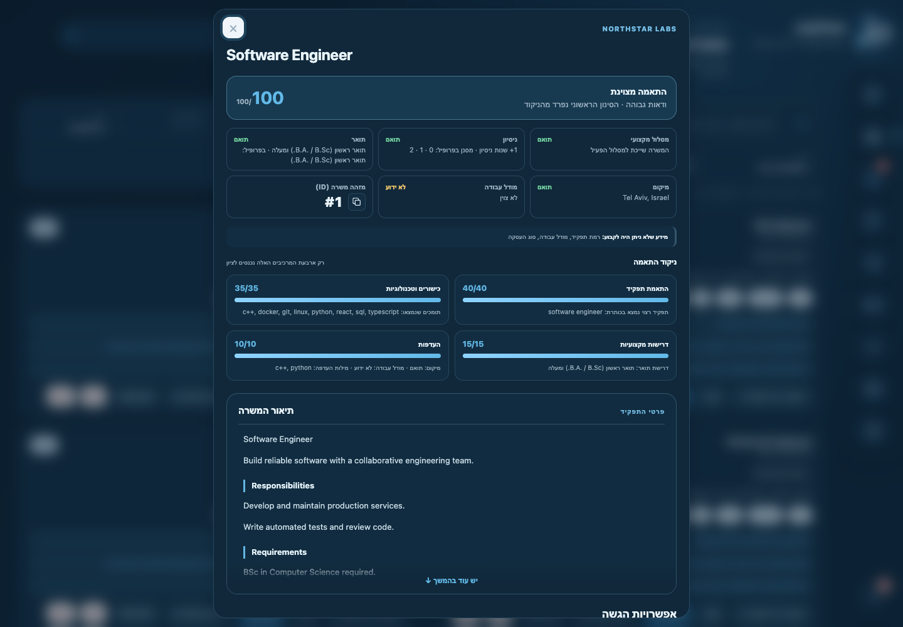
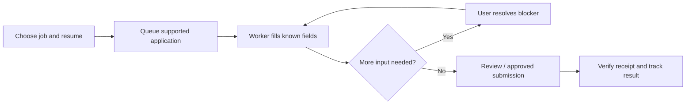
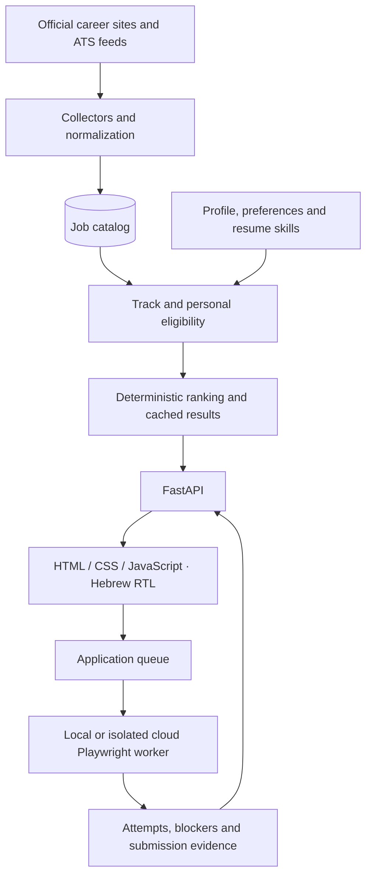

# JobPilot

**Find relevant jobs. Understand the match. Track every application.**

JobPilot collects jobs from official career sites and public applicant-tracking systems, filters them against a personal profile, and explains each compatibility score. Supported application flows can run through a Playwright worker, with explicit approval and a handoff when user input is needed.

[Live application](https://jobpilot-zxgg.onrender.com) · [Run locally](#run-locally) · [Ranking](#how-ranking-works) · [Architecture](#architecture) · [Development](#development)

The interface is in **Hebrew, with RTL support**, light and dark themes, and desktop and mobile layouts. This README describes the current working tree; the hosted application may be on an earlier revision.


*Screenshots use fictional jobs and a demonstration profile in an isolated local database. Company names, scores and counts are illustrative; they are not live vacancies or production metrics.*

## What you can do

- **Discover jobs** across official employer sites and ATS providers, including Greenhouse, Lever, Ashby, SmartRecruiters, Workday and company-specific collectors.
- **Choose a professional track:** Computer Science, Electrical Engineering, or Industrial Engineering & Management.
- **Filter before scoring** using your search preferences, then inspect an explainable match score for eligible jobs.
- **Search and organize results** by title, company, location, score and application status. Submitted jobs are hidden by default in the Jobs tab; a toggle brings them back.
- **Manage a profile and resume versions**, with structured education, experience, skills and reusable application answers.
- **Prepare supported applications**, resolve missing information, and track queue state, attempts and submission evidence.

Guest mode offers read-only exploration without creating an account. Personal profile changes and application actions require a user workspace; available features depend on deployment configuration.

## Product tour

### Dashboard

A summary of the job catalog, personal matches, applications and pending actions. The “חם מהסריקה” panel selects up to three additional jobs discovered in the last 14 days with a current score of at least 70, excluding the five main recommendations and jobs already submitted, hidden or skipped. It can be empty when no jobs meet those conditions.


### Jobs and match details

Search, location filters, sorting and pagination keep the list manageable. Each job has a stable ID with a copy button, individual eligibility indicators, score components and the original description. Long descriptions and explanations scroll inside compact panels.




### Search preferences

Configure desired roles, skills, experience, locations, work modes and exclusions. Changes that only affect visibility can reuse valid scoring components; newly eligible jobs are scored when needed.

One seniority selection controls visibility: checked levels are included, unchecked levels are filtered before scoring, including in dashboard suggestions. Jobs without an explicit title level have a separate option. An empty selection shows no jobs.


### Sources

Inspect source state, enable or disable boards, and add supported sources. Collectors normalize listings into a common job model. Incomplete or blocked feeds preserve existing jobs rather than treating missing results as proof that every vacancy has closed.


## How ranking works

Ranking is deterministic: the scoring path does not require an LLM call.

1. **Collect and normalize** the source posting, title, description and location.
2. **Determine track relevance and eligibility** against the user's profile and configured filters.
3. **Stop for excluded jobs.** Persist the eligibility explanation without computing a full compatibility score.
4. **Score eligible jobs** using four components, with these default weights:

| Component | Maximum | What it measures |
| --- | ---: | --- |
| Role match | 40 | Desired title or related role family |
| Skills and technologies | 35 | Required and preferred skills found in the profile |
| Professional requirements | 15 | Education and identified professional prerequisites |
| Preferences | 10 | Location, work mode and preference keywords |

The final score is bounded to **0–100**, with deductions and caps explained separately. An unidentified degree or experience requirement currently incurs a **single 30-point deduction**, including when both are unknown. Experience explicitly listed as an advantage is distinguished from a missing requirement.

Degree indicators distinguish an explicit match, a preference or related alternative, and a mismatch. Unknown information remains visible so the user can inspect the original posting. A high score is a recommendation, not a guarantee of eligibility or application success.

Stored results are reused when their job content, relevant profile inputs, engine and configuration remain valid. Changes to eligibility do not automatically require recalculating every score component.

Implementation details: [filter-first ranking](docs/RANKING_FILTER_FIRST.md).

## Professional tracks and the unified catalog

| Track | Examples |
| --- | --- |
| Computer Science | Software development, algorithms, AI/ML, research, embedded software and QA |
| Electrical Engineering | Hardware, verification, FPGA/ASIC, RF, signal processing and embedded engineering |
| Industrial Engineering & Management | Analytics/BI, operations, planning, supply chain, procurement, projects and information systems |

Classification considers the role and stated education requirements. A job may belong to more than one track; different users retain their own preferences and ranking results.

**Local preview:** the unified-source catalog and migration workflow are being validated on isolated local databases. They are not enabled in cloud deployments by default. The preview collects each canonical board once, maps a job to its relevant tracks, and keeps personal rankings separate. Do not infer production rollout from the screenshots.

See [canonical catalog rollout and verification](docs/CANONICAL_CATALOG_LOCAL.md).

## Application workflow



- A local Playwright agent can use a persistent browser session.
- An isolated cloud worker handles configured supported ATS flows.
- Unknown required questions, CAPTCHA, authentication challenges and ambiguous pages require user input.
- Automatic queueing and permission to submit are separate controls. Final submission is disabled by default in local configuration.
- Submission attempts retain history and evidence. An ambiguous outcome can remain pending verification.
- LinkedIn application flows are not automated.

The web application and browser worker are separate processes. Installing the web server alone does not start an application agent.

## Architecture



| Layer | Implementation |
| --- | --- |
| API and validation | Python, FastAPI, Pydantic |
| Persistence | SQLAlchemy 2; SQLite locally, PostgreSQL for cloud |
| Cloud identity and files | Supabase Auth and private Storage |
| Collection | HTTPX, BeautifulSoup and Playwright where needed |
| Frontend | Build-free vanilla JavaScript, HTML and CSS |
| Automation | Playwright / Chromium |
| Deployment | Docker, Render and GitHub Actions workers |
| Tests | Pytest, FastAPI TestClient and Playwright browser tests |

Private data is scoped to the active user. Cloud deployments support revocable agent tokens and private file storage. Scans can run in external workers so browser-heavy collection does not share the web process's resources.

## Run locally

### Requirements

- macOS or Linux
- Python 3.11 or later
- Chromium installed through Playwright for browser-based collectors and application automation

### Start the web application

```bash
git clone https://github.com/almogkarif/JobPilot.git
cd JobPilot
./start.sh
```

Open **http://127.0.0.1:8000**.

The script creates `.venv`, installs dependencies and creates `.env` from the example if it does not exist. It also replaces the example agent token with a random value when OpenSSL is available. Review `.env` before connecting external services.

Install the browser when needed:

```bash
.venv/bin/python -m playwright install chromium
```

If port 8000 is occupied:

```bash
JOBPILOT_PORT=8001 ./start.sh
```

Set `JOBPILOT_BASE_URL` to the same URL when connecting an agent to a different port.

### Start the local agent

In another terminal:

```bash
./start-agent.sh
```

Visible browser mode is the default. Configure the agent URL and token to match the web server. Do not enable final submission until you have reviewed the application workflow and permissions.

### Manual installation

```bash
python3 -m venv .venv
source .venv/bin/activate
pip install -r requirements.txt
python -m playwright install chromium
cp .env.example .env
python run.py
```

Copy the environment template only for a fresh installation; preserve an existing `.env`.

## Configuration and cloud deployment

Use [`.env.example`](.env.example) for local mode and [`.env.cloud.example`](.env.cloud.example) for cloud configuration.

| Variable | Purpose |
| --- | --- |
| `JOBPILOT_AUTH_MODE` | Local identity or Supabase authentication |
| `JOBPILOT_DATABASE_URL` | SQLite or PostgreSQL connection |
| `JOBPILOT_STORAGE_MODE` | Local filesystem or Supabase Storage |
| `JOBPILOT_BASE_URL` | Server URL used by the worker |
| `JOBPILOT_AGENT_TOKEN` | Agent authentication secret |
| `JOBPILOT_WORKER_TYPE` | Local or cloud worker |
| `JOBPILOT_AUTO_SUBMIT` | Local agent final-submit permission; defaults to false |
| `JOBPILOT_SCHEDULER_ENABLED` | Enable or disable scheduled work |
| `JOBPILOT_SCAN_EXECUTION_MODE` | In-process or external scanning, as configured for the deployment |

Deployment files include `Dockerfile`, `Dockerfile.worker`, `render.yaml`, and the scan/application workflows in `.github/workflows/`.

- [Cloud setup — English](CLOUD-SETUP.md)
- [Cloud setup — Hebrew](CLOUD-SETUP-HE.md)
- [Database egress budget and query rules](docs/SUPABASE_EGRESS.md)

Keep Supabase server secrets, database credentials and worker tokens outside Git. Optional Gmail receipt verification requires its own OAuth configuration.

## Development

```bash
source .venv/bin/activate
pip install -r requirements-test.txt
python -m playwright install chromium
pytest -q
```

Focused checks:

```bash
pytest -q tests/test_ranking_v2.py tests/test_ranking_targeted_refresh.py
pytest -q tests/test_api.py tests/test_multiuser_isolation.py
pytest -q tests/test_supabase_egress_optimization.py
pytest -q tests/test_ui_e2e.py
```

Browser tests start an isolated local server and require permission to bind a loopback port. Test results depend on the revision and environment; screenshots do not imply that the complete test suite has passed.

```text
app/
  collectors/          ATS and employer-specific ingestion
  services/ranking/    Eligibility, score components and result reuse
  services/            Scanning, classification, catalog and application services
  static/              Hebrew RTL interface
  main.py              API and application lifecycle
  models.py            Persistence models
  database.py          Database setup and user scoping
agent/                 Browser worker and form handling
scripts/               Scan workers, comparisons and migration tools
tests/                 API, ranking, isolation, collector and browser tests
docs/                  Technical notes and product screenshots
```

## Limitations

Employer sites and ATS forms change, and some block automated collection. Extracted requirements can be incomplete; users should review the source posting. Automation supports specific flows and pauses where it cannot proceed reliably. The cloud configuration targets a small deployment, and its database/storage resource budget must be respected.

Resumes, private application screenshots, browser profiles, `.env` files and database copies are runtime data, not repository assets. The screenshots in this README contain demonstration data only.
