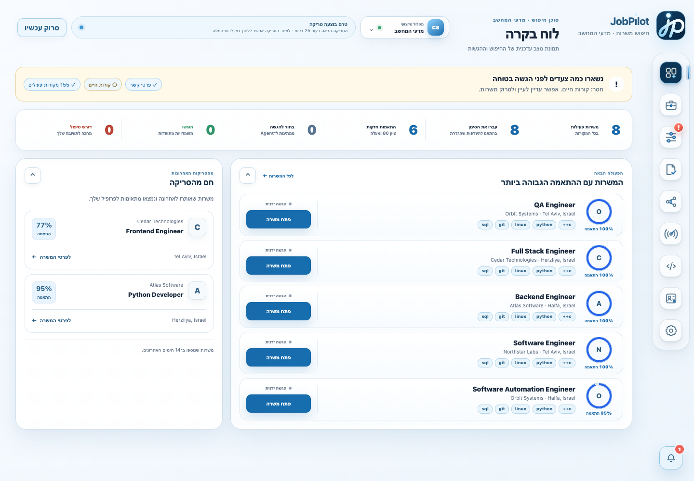
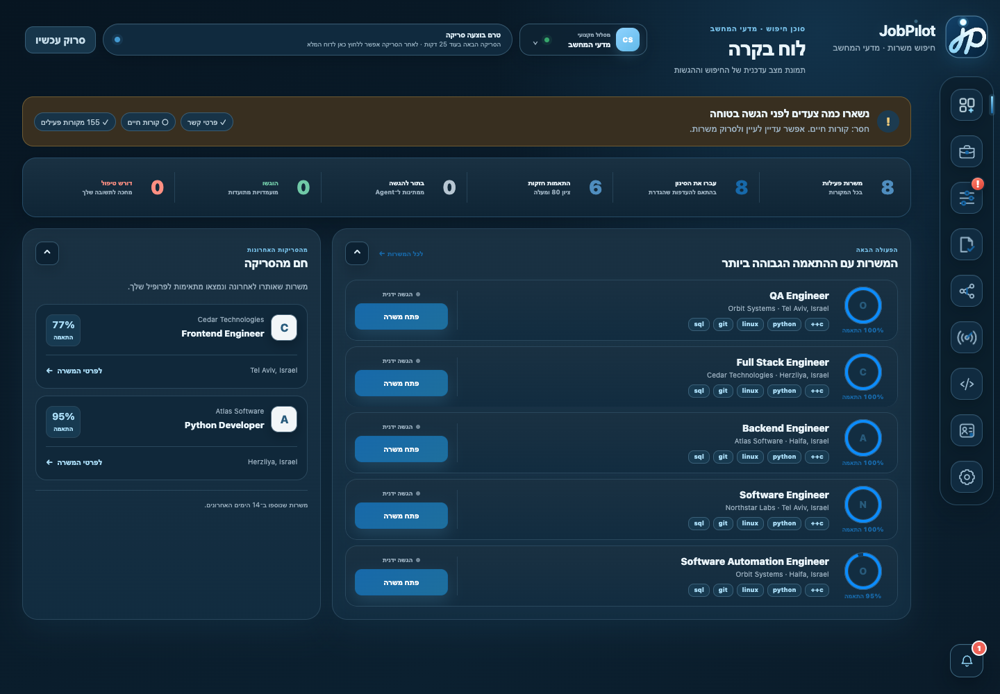
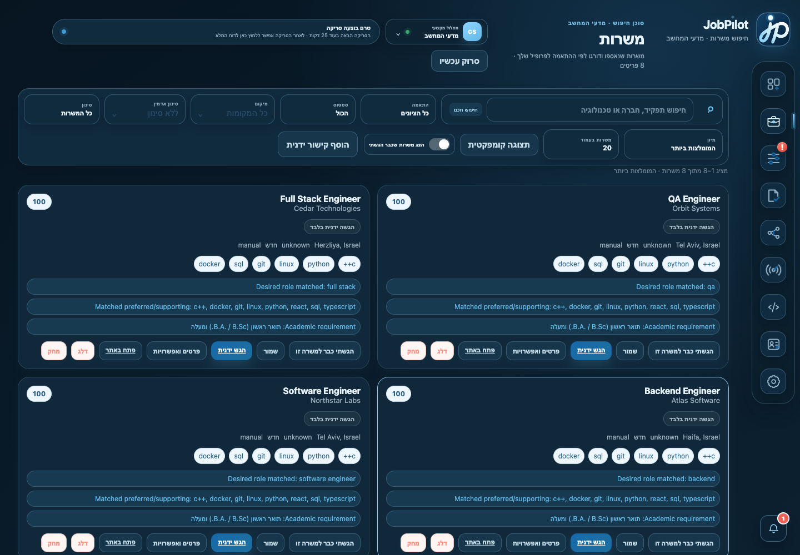
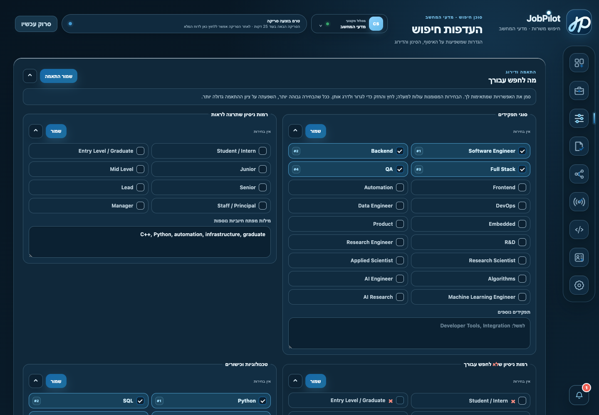
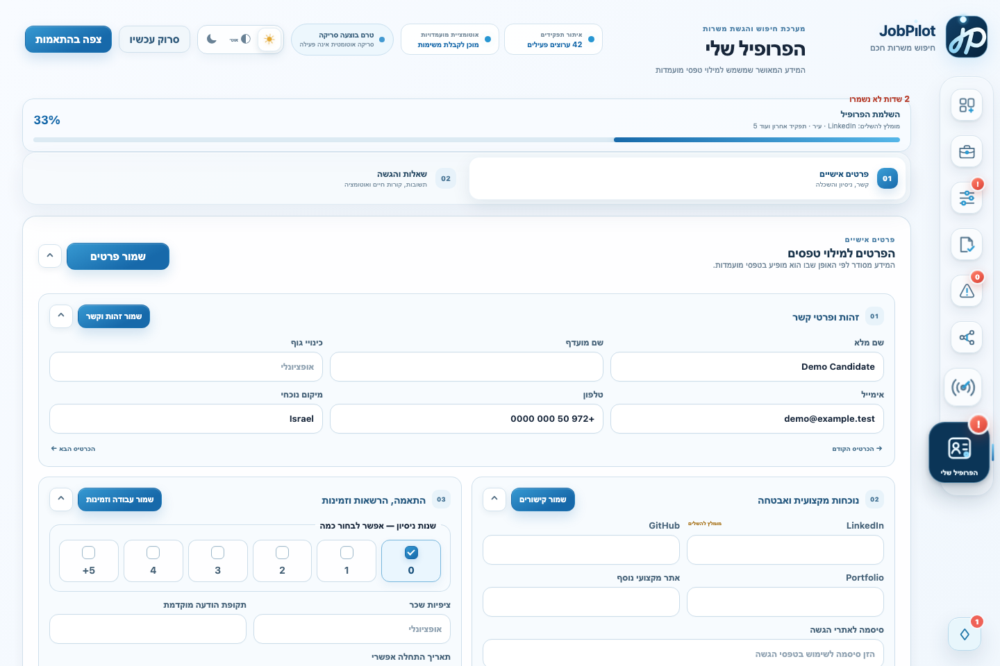
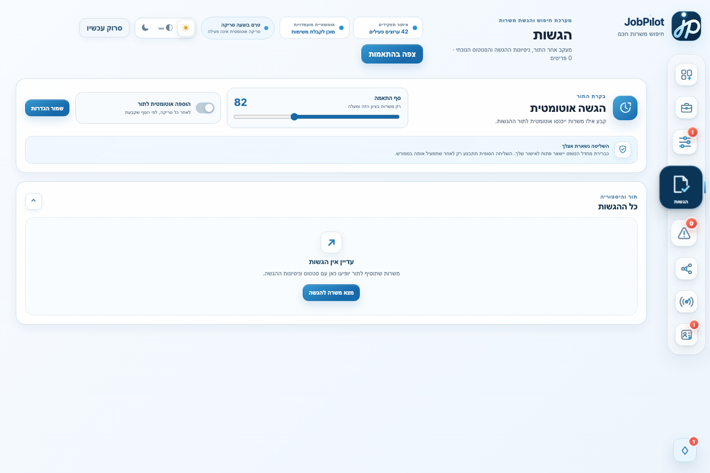
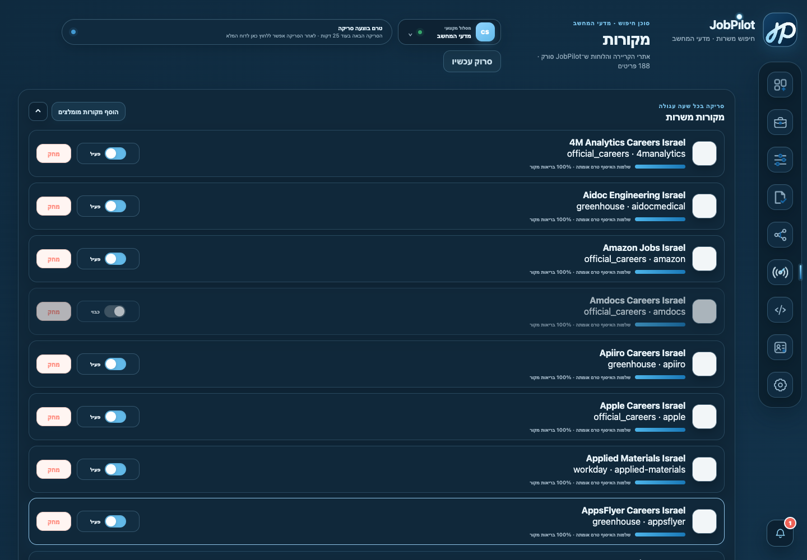

# JobPilot

**A full-stack job discovery, matching, and human-in-the-loop application platform.**

[**Open the live application**](https://jobpilot.onrender.com) · [**View the source code**](https://github.com/almogkarif/JobPilot) · [Architecture](#architecture) · [Run locally](#quick-start--local-mode)

> **Recruiter?** Start with the [60-second overview](#for-recruiters--60-second-overview), then open the live application and choose **Continue as guest** (`המשך כאורח`). The product UI is intentionally built in Hebrew with full RTL support; the engineering documentation is in English.

JobPilot scans official career sites and public ATS boards, normalizes and filters jobs, scores each role against a user's profile, and can prepare or submit supported ATS forms through a local or isolated cloud Playwright worker under explicit, one-time user approval.

The project started as a local-first personal tool and evolved into a small multi-user cloud application with Supabase authentication/storage, PostgreSQL persistence, Docker deployment, scheduled scanning, and tenant-isolated data.

> **Current version:** `v0.3.2`  
> **UI:** Hebrew / RTL  
> **Backend:** FastAPI + SQLAlchemy  
> **Cloud:** PostgreSQL + Supabase + Render  
> **Automation:** Playwright + GitHub Actions



## For recruiters — 60-second overview

JobPilot is an end-to-end production project rather than a UI prototype. It brings together data collection, normalization, explainable ranking, multi-user authentication, browser automation, security controls, cloud deployment, and a responsive frontend in one working system.

| What to evaluate | Where it appears |
| --- | --- |
| Product thinking | Job discovery, ranked recommendations, application tracking, profile onboarding, and explicit human approval before submission |
| Backend engineering | FastAPI APIs, SQLAlchemy models, PostgreSQL/SQLite support, background scanning, data cleanup, and per-source failure isolation |
| Data and ranking | Multi-source normalization, career-track filtering, resume-derived profile data, deterministic scoring, and readable match explanations |
| Automation | A local Playwright agent that fills supported ATS forms, pauses on uncertainty, and hands control back to the user |
| Security and reliability | Supabase Auth, tenant isolation, private file storage, hashed device tokens, fail-closed automation, and automated tests |
| Delivery | Docker deployment on Render and scheduled scan workers in GitHub Actions |

### Quick product walkthrough

1. Open the [live application](https://jobpilot.onrender.com).
2. Select **Continue as guest** (`המשך כאורח`) to explore without creating an account.
3. Review the dashboard and open the ranked jobs list to inspect scores and match explanations.
4. Switch between Computer Science, Electrical Engineering, and Industrial Engineering & Management to see track-specific jobs and preferences.
5. Visit Sources, Applications, Profile, and Settings to see the rest of the workflow.

Guest access is read-only and uses the live job catalog, so personal changes and application actions are disabled. The hosted web application demonstrates the product and ranking workflow; browser-based application filling runs locally by design because it requires a private browser session and explicit user handoff.

## Why I built it

Searching for jobs is repetitive, but fully automating applications creates obvious quality and trust problems. JobPilot is built around a different idea: automate collection, filtering, ranking, repetitive form filling, and tracking — while keeping uncertain answers, CAPTCHAs, and the final submit action visible to the user.

The project combines product work, backend engineering, browser automation, data modeling, scoring logic, cloud deployment, security boundaries, and a custom frontend in one system.

## Engineering highlights

- **Multi-source job ingestion** from Greenhouse, Ashby, Lever, Google Careers, Workday, and company-specific career pages.
- **Deterministic matching engine** with explainable 0–100 scoring based on titles, seniority, skills, experience, location, work mode, keywords, exclusions, company, and freshness.
- **Multi-user cloud architecture** with Supabase Auth, PostgreSQL, per-user workspaces, and tenant isolation enforced in the application data layer.
- **Human-in-the-loop browser automation** using a persistent local Playwright agent for application preparation.
- **Fail-closed automation controls** for unknown required questions, CAPTCHA detection, ambiguous submissions, and final-submit approval.
- **Local + cloud modes** using the same application codebase: SQLite/local storage for a personal installation, or PostgreSQL/Supabase for deployment.
- **Background scanning** runs in GitHub Actions, isolated from the Render web process, with bounded concurrency, stale-job cleanup, per-source error isolation, and durable progress stored in PostgreSQL.
- **Dockerized web deployment** on Render plus a separate GitHub Actions scan worker, so browser-heavy collectors cannot exhaust the web service memory.
- **Custom build-free frontend** with Hebrew RTL support, light/dark themes, command palette, keyboard navigation, responsive layouts, and persistent UI state.
- **Automated test coverage** across API behavior, matching, tenant isolation, cloud auth/storage contracts, browser automation, collectors, and UI flows.

## Architecture

```text
                           ┌───────────────────────────────┐
                           │ Official career sites / ATS  │
                           │ Greenhouse · Ashby · Lever   │
                           │ Workday · Google · custom    │
                           └───────────────┬───────────────┘
                                           │
                                           ▼
                                ┌──────────────────────┐
                                │ Collectors + parser  │
                                └──────────┬───────────┘
                                           │
                         normalize · Israel filter · dedupe
                                           │
                                           ▼
                                ┌──────────────────────┐
                                │ Matching engine      │
                                │ explainable 0–100    │
                                └──────────┬───────────┘
                                           │
                    ┌──────────────────────┴──────────────────────┐
                    │                                             │
                    ▼                                             ▼
          ┌──────────────────┐                         ┌────────────────────┐
          │ SQLite           │                         │ PostgreSQL         │
          │ local mode       │                         │ cloud mode         │
          └────────┬─────────┘                         └─────────┬──────────┘
                   └──────────────────────┬──────────────────────┘
                                          ▼
                               ┌──────────────────────┐
                               │ FastAPI application  │
                               │ API + static UI      │
                               └──────────┬───────────┘
                                          │
                  ┌───────────────────────┴────────────────────────┐
                  │                                                │
                  ▼                                                ▼
       ┌─────────────────────┐                         ┌──────────────────────┐
       │ Browser UI          │                         │ Local Playwright     │
       │ jobs/profile/admin  │                         │ Application Agent    │
       └─────────────────────┘                         └──────────┬───────────┘
                                                                │
                                                 fill · pause · handoff
                                                                │
                                                                ▼
                                                     final user review
```

### Cloud boundary

The server can run remotely with either a local browser agent or an isolated cloud worker. The cloud worker is limited to supported anonymous ATS flows; sites requiring an existing personal session, CAPTCHA, or manual intervention are handed back to the local agent/user.

In cloud mode:

- Supabase handles user authentication.
- PostgreSQL stores application data.
- Supabase Storage stores private resumes and screenshots.
- Private rows carry a `user_id` and are automatically scoped to the active user.
- PostgreSQL startup hardening enables RLS on private tables and removes direct browser access to those tables.
- Per-device agent tokens are revocable and stored hashed rather than in plaintext.
- The application agent can be restricted to a configured account during beta deployments.
- Every claimed task creates an idempotent attempt record; a submission is not marked successful without structured confirmation evidence.
- Optional Gmail read-only verification can confirm ambiguous submissions from receipt emails without storing message contents.

## Product tour

### Dashboard

The dashboard summarizes active jobs, strong matches, queued/submitted applications, blockers, scanner state, and recommended jobs.



### Job discovery and ranking

Jobs are normalized into one model regardless of source. The Jobs view supports text search, score/status filters, compact or comfortable layouts, match explanations, missing skills, queueing, skipping, and permanent deletion.



### Ranked search preferences

Search preferences are ordered, not just selected. Users can rank desired job families, seniority, skills, locations, work modes, and positive keywords. Higher-priority preferences contribute more to the matching score, while explicit exclusions act as hard filters.



### Professional tracks

JobPilot treats a profession as a first-class search context. `v0.3.2` includes:

- **Computer Science** — software, infrastructure, algorithms, AI/ML, research, and backend roles.
- **Electrical Engineering** — electronics, hardware, embedded systems, verification, board design, control, RF, and related engineering roles.
- **Industrial Engineering & Management** — operations, analytics/BI, supply chain, planning, procurement, projects, process improvement, manufacturing, quality, and NPI.

Sources, jobs, matching preferences, resumes, applications, and recommendations are isolated by career track. Identity and reusable application answers remain shared intentionally.

### Profile and resume intelligence

The profile stores structured information commonly requested by ATS forms: identity, contact details, links, work authorization, education, employment, languages, certifications, compensation preferences, and resume versions.

Resume analysis extracts skills, names, contact details, and professional links. Blank profile fields are filled automatically after an upload, while existing user-entered values are preserved and never overwritten silently.



### Application workflow

Applications move through explicit states such as queued, applying, blocked, failed, and submitted. Automatic queueing and automatic final submission are deliberately separate controls.



The local agent can:

1. Open the official application URL.
2. Find and open the application flow.
3. Reuse an existing session or create an account when appropriate.
4. Fill supported contact, work, education, language, website, skill, and questionnaire fields.
5. Upload the selected resume.
6. Continue through intermediate steps.
7. Stop when it encounters an unknown required question, CAPTCHA, missing profile value, or ambiguous page state.
8. Pause before final submission unless a one-time approval is explicitly available.

### Human-in-the-loop blockers

JobPilot creates an actionable blocker instead of guessing when it encounters:

- CAPTCHA or human verification;
- an unfamiliar required field;
- missing profile data;
- unsupported/ambiguous application controls;
- a form waiting for final review;
- a submission without a reliable success signal.

Blockers can store the page URL, explanation, options, and screenshot. The user can answer, remember an approved answer, retry, skip, or finish manually.

### Sources

Sources can be enabled, disabled, installed from the built-in catalog, added manually, inspected, or removed. One failing collector does not stop the rest of a scan.



## Matching model

The matching engine is deterministic and returns both a score and readable reasons.

| Signal | Behavior |
| --- | --- |
| Desired title | Strong positive signal, weighted by preference rank |
| Seniority | Rewards desired levels and penalizes roles that are too senior |
| Skills | Scores overlap and weights higher-priority profile skills more heavily |
| Experience | Compares extracted year requirements with configured experience |
| Location | Rewards preferred Israeli locations in priority order |
| Work mode | Rewards remote, hybrid, or onsite according to preference |
| Keywords | Adds a smaller ranked bonus without double-counting seniority |
| Exclusions | Hard-filter unwanted title/domain/seniority patterns |
| Freshness | Adds a small bonus to recently published jobs |
| Company | Adds a modest signal without overriding role fit |

Scores are clamped to `0..100` and each contribution is exposed to the UI.

## Safety principles

JobPilot's default is **prepare, review, then submit**.

- It does not bypass CAPTCHAs.
- It does not automate inside LinkedIn.
- It does not invent skills, experience, or application answers.
- Unknown required questions become blockers.
- Final submission is disabled by default in local mode.
- One-time final approval is consumed when a task is claimed to reduce duplicate submission risk.
- Agent tasks are claimed atomically.
- Stuck tasks can return to the queue after a timeout.
- Application attempts and blockers are auditable.

Browser profiles, resumes, application passwords, database files, and application screenshots are treated as private runtime data and are excluded from Git.

## Tech stack

| Area | Technology |
| --- | --- |
| Backend | Python 3.11+ / FastAPI / Pydantic |
| ORM | SQLAlchemy 2 |
| Local database | SQLite |
| Cloud database | PostgreSQL / Supabase |
| Authentication | Supabase Auth |
| File storage | Local filesystem or Supabase Storage |
| Browser automation | Playwright / Chromium |
| Collection/parsing | HTTPX / BeautifulSoup / Playwright where rendering is required |
| Frontend | Vanilla JavaScript / HTML / CSS, Hebrew RTL |
| Deployment | Docker / Render |
| Scanning | GitHub Actions worker + PostgreSQL-backed scan queue/status |
| Testing | Pytest + FastAPI TestClient + browser/UI tests |

## Quick start — local mode

### Requirements

- macOS or Linux
- Python 3.11+
- approximately 1 GB free for the environment and Playwright browser

### Start the server

```bash
cp .env.example .env
./start.sh
```

Open:

```text
http://127.0.0.1:8000
```

`start.sh` creates the virtual environment when needed, installs dependencies, creates `.env`, and replaces the insecure example agent token with a random value when OpenSSL is available.

### Start the local application agent

In a second terminal:

```bash
./start-agent.sh
```

The first run installs Playwright Chromium. Visible browser mode is the default and final submission remains disabled unless explicitly configured.

### Manual installation

```bash
python3 -m venv .venv
source .venv/bin/activate
python -m pip install --upgrade pip
pip install -r requirements.txt
python -m playwright install chromium
cp .env.example .env
python run.py
```

## Cloud deployment

The repository includes everything required for a small cloud deployment:

```text
Dockerfile
render.yaml
.env.cloud.example
.github/workflows/jobpilot-scan.yml
scripts/migrate_to_cloud.py
CLOUD-SETUP.md
CLOUD-SETUP-HE.md
```

High-level flow:

```text
GitHub repository
      │
      ▼
Render Blueprint ──────► FastAPI server
      │                       │
      │                       ├──► Supabase Auth
      │                       ├──► PostgreSQL
      │                       └──► Supabase Storage
      │
      └── GitHub Actions ───► collectors + matching ───► PostgreSQL

Local Mac ─────────────► authenticated Agent API ─► Playwright/Chromium
Cloud worker ──────────► supported anonymous ATS ─► evidence receipt
```

Deployment values are supplied as environment variables; real credentials are never committed to the repository.

For the complete setup, see:

- [`CLOUD-SETUP.md`](CLOUD-SETUP.md) — English
- [`CLOUD-SETUP-HE.md`](CLOUD-SETUP-HE.md) — Hebrew

## Important configuration

| Variable | Purpose |
| --- | --- |
| `JOBPILOT_AUTH_MODE` | `local` or `supabase` |
| `JOBPILOT_STORAGE_MODE` | local filesystem or Supabase Storage |
| `JOBPILOT_DATABASE_URL` | SQLite or PostgreSQL SQLAlchemy URL |
| `JOBPILOT_BASE_URL` | Public/local server URL used by agents |
| `JOBPILOT_AGENT_TOKEN` | Legacy/local shared agent secret |
| `JOBPILOT_WORKER_TYPE` | `local` or `cloud`; cloud claims only the supported anonymous ATS allowlist |
| `JOBPILOT_APPLICATION_AGENT_OWNER_EMAIL` | Optional account allowed to pair the cloud application agent |
| `JOBPILOT_ALLOWED_EMAILS` | Optional cloud allowlist |
| `JOBPILOT_MAX_USERS` | Admission cap for a small deployment |
| `JOBPILOT_SUPABASE_URL` | Supabase project URL |
| `JOBPILOT_SUPABASE_PUBLISHABLE_KEY` | Browser-safe Supabase key |
| `JOBPILOT_SUPABASE_SECRET_KEY` | Server-only Supabase key |
| `JOBPILOT_CRON_SECRET` | Compatibility secret for the legacy cron endpoint |
| `JOBPILOT_GITHUB_ACTIONS_TOKEN` | Fine-grained GitHub token used by Render only to dispatch a manual scan workflow |
| `JOBPILOT_SCAN_EXECUTION_MODE` | Set to `external` in cloud so Render never runs collectors |
| `JOBPILOT_AUTO_SUBMIT` | Local agent final-submit permission; default false |
| `JOBPILOT_GOOGLE_OAUTH_CLIENT_ID` / `...SECRET` | Optional Google OAuth web credentials for Gmail receipt verification |
| `JOBPILOT_GOOGLE_OAUTH_REDIRECT_URI` | Exact public callback: `/api/integrations/gmail/callback` |

### Background submission worker

`Dockerfile.worker` runs the Playwright worker separately from the web service. Supply `JOBPILOT_BASE_URL`, a paired `JOBPILOT_AGENT_TOKEN`, and `JOBPILOT_WORKER_TYPE=cloud`. The worker accepts only Greenhouse, Comeet, Lever, Ashby, and SmartRecruiters tasks that carry a consumed one-time approval. Workday, custom sites, CAPTCHA, and uncertain pages remain local/manual. Keep one replica while using the beta queue.

For a no-cost public-repository deployment, `.github/workflows/jobpilot-application.yml` runs one isolated headless worker on demand. The web server dispatches it immediately after one-time approval. An administrator adds `JOBPILOT_AGENT_TOKEN` and `JOBPILOT_BASE_URL` as GitHub Actions repository secrets once. The credential-management card is admin-only; regular users can request background submissions but never receive or manage worker credentials. Each workflow is restricted to its dispatched application and is tenant-scoped to that application's owner before any profile, resume, or result access.

The Applications page provides a dry run before campaign activation, daily and total caps, a company deny-list, durable attempt history, and a verification receipt. A queued task can finish in `verification_pending`; it becomes `submitted` only after page evidence or an optional Gmail receipt confirms it.

See `.env.example` and `.env.cloud.example` for safe templates.

## Project structure

```text
jobpilot/
├── app/
│   ├── collectors/            # ATS and official-career collectors
│   ├── services/              # scanning, matching, cleanup, source catalog
│   ├── static/                # build-free Hebrew RTL frontend
│   ├── auth.py                # cloud identity + agent device auth
│   ├── database.py            # engine, tenant scoping, migrations
│   ├── main.py                # FastAPI API, scheduler, static app
│   ├── models.py              # SQLAlchemy models
│   ├── schemas.py             # Pydantic request models
│   └── storage.py             # local/Supabase storage adapters
├── agent/
│   ├── browser.py             # application navigation/filling
│   ├── fields.py              # approved profile/question mapping
│   └── run_agent.py           # polling, claim, handoff, reporting
├── scripts/
│   └── migrate_to_cloud.py    # SQLite -> cloud migration helper
├── docs/screenshots/
├── tests/
├── .github/workflows/
├── Dockerfile
├── render.yaml
├── start.sh
├── start-agent.sh
└── run.py
```

## Testing

Run the complete suite:

```bash
pytest -q
```

Useful focused suites:

```bash
pytest -q tests/test_matching.py
pytest -q tests/test_api.py
pytest -q tests/test_cloud_mode.py
pytest -q tests/test_multiuser_isolation.py
pytest -q tests/test_agent_browser_flow.py
```

The suite covers matching behavior, Israel-only filtering, API contracts, scanner resilience, profile/career-track state, cloud authentication, tenant isolation, storage adapters, agent-device tokens, browser form handling, blockers, resume handling, and final-submit controls.

## Current limitations

- Career sites change markup and anti-bot behavior; collectors occasionally require maintenance.
- Some ATS widgets still need dedicated adapters even when they look like standard form controls.
- The cloud worker supports only allowlisted anonymous ATS flows; session-bound and unsupported forms still require the local agent.
- Application-agent access can be intentionally restricted to one configured account during the current beta architecture.
- LinkedIn application flows are intentionally not automated.
- Automatic answers are limited to supplied profile data and explicitly approved answer-library entries.
- The cloud deployment is designed for a small private user group, not large-scale public SaaS traffic.

## Privacy and repository hygiene

The repository intentionally ignores private runtime data such as:

```text
.env
data/*.db
data/resumes/*
data/screenshots/*
agent/browser-profile/
```

Before publishing a fork or deployment, verify staged files with:

```bash
git status
git diff --cached --name-only
```

Never commit Supabase secret keys, database passwords, agent tokens, resumes, application screenshots, or Chromium profile data.

## Version 0.3.2

The current release focuses on cloud hardening and the transition from a personal local application to a small multi-user deployment:

- per-user and per-career-track source controls;
- Supabase authentication and private storage;
- PostgreSQL tenant isolation and startup hardening;
- local per-device application agents with revocable tokens;
- bounded multi-user scan concurrency;
- Docker/Render deployment configuration;
- browser-heavy scanning isolated in GitHub Actions, with durable DB-backed progress;
- improved collector URL identity and official-career parsing;
- UI hardening across desktop/mobile and both professional themes.

## Disclaimer

JobPilot is an automation project, not a guarantee of application success. Users are responsible for reviewing submitted information and for complying with the terms and policies of each career site.
